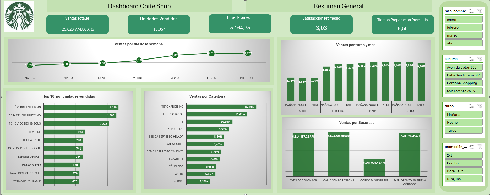
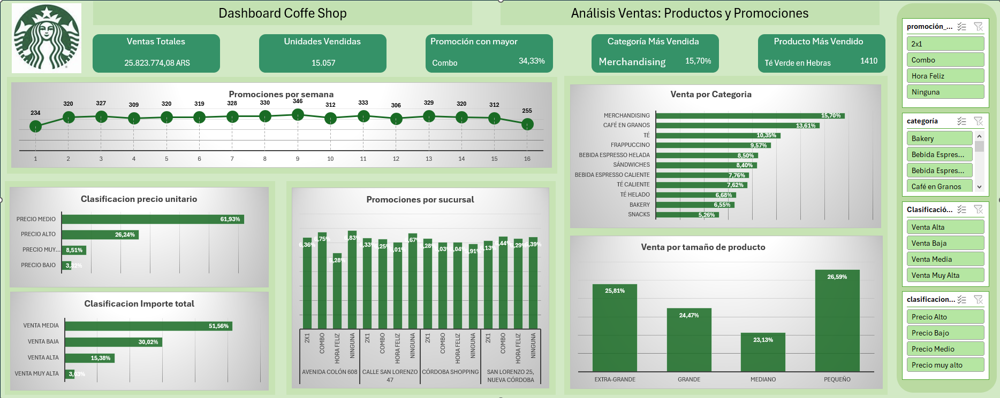
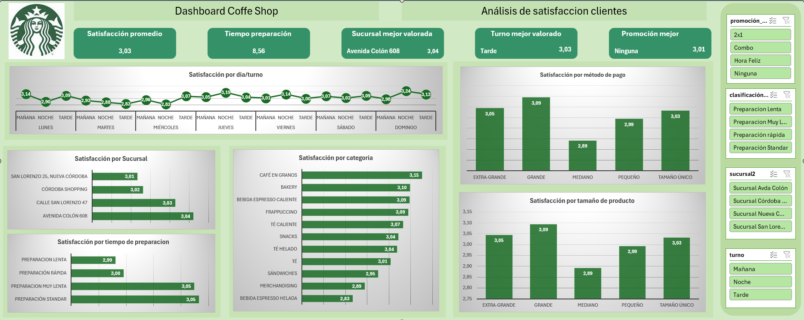

# Starbucks Sales Dashboard 2025

## Descripción

Este proyecto, desarrollado como parte de un bootcamp de Data Analytics, presenta dashboards interactivos en Excel para analizar las ventas de Starbucks en cuatro sucursales en Córdoba, Argentina, durante los primeros cuatro meses de 2025 (enero a abril). Los dashboards visualizan KPIs clave y tendencias por sucursal, producto, promoción y satisfacción , ofreciendo insights accionables para gerentes, equipos de marketing y directores regionales.

El dataset utilizado es `dashboard_starbucks_2025.xlsx`, que contiene 5,000 transacciones con métricas como ventas totales, productos, métodos de pago, tiempos de preparación y satisfacción del cliente.

## 🗂 Estructura del Proyecto

```bash
Coffe-Shop-Sales-Analysis
|----dashboard
|   |----dashboard_starbucks_2025.xlsx      # Dashboard final en formato Excel
|----data/
|   |----ventas_starbucks_2025.csv         # Archivo original CSV con los datos
|----img/                                 # Imagenes para incluir en Readme.md
|   |----AnalisisSatisfaccion.png
|   |----AnalisisVentas.png
|   |----Dashboard-General.png
|----README.md
|----.gitignore
```

---

## Requisitos

- **Microsoft Excel** (versión 2016 o superior) para abrir y usar los dashboards.
- Acceso a GitHub para clonar el repositorio.

## Instalación y Configuración

1. Clona el repositorio:

   ```bash

   git clone https://github.com/MariCruzTE/Coffe-Shop-Sales-Analysis.git
   cd Coffe-Shop-Sales-Analysis

   ```

2. Asegúrate de que el archivo dashboard_starbucks_2025.xlsx esté en la carpeta data/.
3. Abre el archivo dashboards/starbucks_dashboard_2025.xlsx en Microsoft Excel.
4. Explora los dashboards usando las segmentaciones de datos (slicers) para filtrar por sucursal, mes, categoría, etc.

## 📊 Dataset

- **Fuente**: [Ventas Starbucks - Kaggle](https://www.kaggle.com/datasets/guadalupesaraviaweht/ventas-starbucks)
- **Formato original**: CSV con 149.000 filas y 18 columnas.
- **Formato Actual**: Excel (dashboard_starbucks_2025.xlsx).
- **Tamaño**: 5.000 filas, 31 columnas (tras procesamiento).
- **Ubicación**: `./data/ventas_starbucks_2025.csv`

## 🔍 Exploratory Data Analysis (EDA)

## 🧾 Diccionario de Variables

A continuación se describen las columnas presentes en el dataset `ventas_starbucks_2025.csv`:

| Columna              | Descripción                                                         |
| -------------------- | ------------------------------------------------------------------- |
| `ID Ticket`          | Identificador único de cada transacción de venta.                   |
| `Fecha`              | Fecha en la que se realizó la venta (formato: DD/MM/AAAA).          |
| `Hora`               | Hora exacta en la que se realizó la compra.                         |
| `Producto`           | Nombre del producto vendido (ej. Latte, Frappuccino, Muffin, etc.). |
| `Tamaño`             | Tamaño del producto vendido (ej. Tall, Grande, Venti).              |
| `Precio Unitario`    | Precio por unidad del producto vendido.                             |
| `Cantidad`           | Número de unidades vendidas en la transacción.                      |
| `Método de pago`     | Medio utilizado para pagar la compra (efectivo, tarjeta, etc.).     |
| `Total Venta`        | Total facturado en la transacción (Precio Unitario x Cantidad).     |
| `Nombre Tienda`      | Nombre o código de la tienda Starbucks donde se realizó la venta.   |
| `Ciudad`             | Ciudad donde se ubica la tienda.                                    |
| `País`               | País correspondiente a la tienda.                                   |
| `Empleado`           | Nombre del empleado que gestionó la transacción.                    |
| `Categoría Producto` | Tipo de producto (bebida caliente, fría, alimento, etc.).           |

## 🧹 EDA Analisis exploratorio inicial

### `id_venta`

- **Descripción**: Identificador único de cada venta, con formato tipo `VTA00001`.
- **Tipo de dato**: Texto (string).
- **Duplicados**: No se han encontrado valores duplicados.
- **Nulos**: No hay valores nulos.
- **Acción necesaria**: Ninguna. Columna limpia.

---

### `fecha`

- **Descripción**: Fecha en la que se realizó la venta.
- **Tipo de dato**: Fecha.
- **Rango de fechas**: Desde `01/01/2025` hasta `18/04/2025`.
- **Valores únicos**: 108 fechas distintas, coherente con el rango de fechas observado.
- **Nulos**: No se han detectado valores nulos.
- **Formato**: Texto
- **Acción necesaria**: Se cambia a formato fecha. Columna lista para análisis temporal.

---

### `hora`

- **Descripción**: Hora en la que se registró la venta.
- **Tipo de dato original**: Texto.
- **Rango observado**: Desde las `07:00` hasta las `21:00`.
- **Nulos**: No se han detectado valores nulos.
- **Acción realizada**: Se ha transformado el tipo de dato a formato hora para facilitar el análisis por franjas horarias.
- **Acción pendiente**: Cambiar a formato hora

---

### `sucursal`

- **Descripción**: Tienda en la que se realizó la venta.
- **Tipo de dato original**: Texto.
- **Valores únicos**: 4 (`San Lorenzo 25`, `Nueva Córdoba`, `Córdoba Shopping`, `Calle San Lorenzo 47`, `Avenida Colón 608`).
- **Observación**: Las sucursales parecen ubicadas en Córdoba, Argentina.
- **Acción recomendada**: Estandarizar los nombres para mejorar la consistencia. Propuesta:
  - `Nueva Córdoba` → `Sucursal Nueva Córdoba`
  - `Córdoba Shopping` → `Sucursal Shopping`
  - `Avenida Colón 608` → `Sucursal Av. Colón`
  - `San Lorenzo 25` → `Sucursal San Lorenzo 25`
  - `Calle San Lorenzo 47` → `Sucursal San Lorenzo 47` .
- **Nulos**: No hay valores nulos.
- **Acción pendiente**: Aplicar estandarización de nombres

---

### `producto`

- **Descripción**: Nombre del producto vendido.
- **Tipo de dato**: Texto.
- **Valores únicos**: 36 productos distintos.
- **Ejemplos**: `Termo Reutilizable`, `Té Verde en Hebras`, `Espresso Roast`, `Caramel Frappuccino`, `Croissant Relleno con Crema de Avellanas`.
- **Nulos**: No se encontraron valores nulos.
- **Acción recomendada**: ✔ No se requiere transformación adicional en esta columna.

---

### `categoría`

- **Descripción**: Clasificación general del producto vendido.
- **Tipo de dato**: Texto.
- **Valores únicos**: 11 categorías distintas.
- **Ejemplos**: `Merchandising`, `Té`, `Snacks`, `Café en Granos`, `Bakery`, `Frappuccino`, `Bebida Espresso Caliente`.
- **Nulos**: No se encontraron valores nulos.
- **Acción recomendada**: - Columna limpia

---

### `tamaño`

- **Descripción**: Indica el tamaño del producto vendido.
- **Tipo de dato**: Texto.
- **Valores únicos**: 5 valores distintos (mezcla de inglés y español).
- **Ejemplos**: `Tall`, `Pequeño`, `Grande`, `Venti`.
- **Nulos**: Aproximadamente el 73% de las celdas están vacías.
- **Inconsistencias detectadas**: Mezcla de idiomas en los nombres de tamaño.
- **Acción recomendada**:
  - 🔄 Estandarizar los valores a un único idioma (por ejemplo, todos en español: `Pequeño`, `Mediano`, `Grande`, `Extra_grande`, etc.).
  - ⚠️ Analizar si los valores nulos se deben a categorías de productos que no tienen tamaño (como merchandising) antes de decidir cómo tratarlos.

---

### `cantidad`

- **Descripción**: Indica la cantidad de unidades vendidas en una transacción.
- **Tipo de dato**: Número entero.
- **Valores únicos**: 5 valores distintos, comprendidos entre 1 y 5.
- **Nulos**: No se detectan valores nulos.
- **Acción recomendada**:
  - ✅ Cambiar el tipo de dato a número entero para facilitar el análisis cuantitativo.

---

### `precio_ud`

- **Descripción**: Precio unitario del producto vendido.
- **Tipo de dato**: Numérico decimal (usa punto como separador decimal).
- **Nulos**: No se detectan valores nulos.
- **Acciones recomendadas**:
  - ✅ Asegurar que el tipo de dato sea numérico decimal (float) para cálculos posteriores.
  - 🔄 Sustituir el punto decimal (`.`) por coma (`,`) para adaptarlo al formato numérico regional.

---

### `total_venta`

- **Descripción**: Precio total de la venta (precio unitario multiplicado por cantidad).
- **Tipo de dato**: Numérico decimal (usa punto como separador decimal).
- **Nulos**: No se detectan valores nulos.
- **Acciones recomendadas**:
  - ✅ Verificar coherencia con el cálculo `precio_ud * cantidad`.
  - 🔄 Sustituir el punto decimal (`.`) por coma (`,`) para adaptarlo al formato numérico regional.

---

### `canal_compra`

- **Descripción**: Canal a través del cual se ha realizado la compra.
- **Tipo de dato**: Texto.
- **Valores únicos**: 3 (`En tienda`, `Take Away`, `Delivery`), mezclando inglés y español.
- **Nulos**: No se detectan.
- **Acciones recomendadas**:
  - 🔄 Estandarizar los valores para un único idioma (preferiblemente español).
    - Ejemplo: `Take Away` → `Para llevar`.

---

### `metodo_pago`

- **Descripción**: Método de pago utilizado en la transacción.
- **Tipo de dato**: Texto.
- **Valores únicos**: 3 (`App`, `tarjeta`, `efectivo`).
- **Nulos**: No se detectan.
- **Acciones recomendadas**:
  - 🔄 Estandarizar formato de texto.
  - 📝 Sustituir `App` por su forma completa (por ejemplo, `Aplicación móvil`).

---

### `cliente_miembro`

- **Descripción**: Indica si el cliente es miembro del programa de fidelización.
- **Tipo de dato**: Texto.
- **Valores únicos**: 2 (`Sí`, `No`).
- **Nulos**: No se detectan.
- **Acciones recomendadas**: Ninguna, columna limpia

---

### `descuento_miembro`

- **Descripción**: Descuento aplicado por ser miembro.
- **Tipo de dato**: Numérico.
- **Valores únicos**: 3 (`0`, `10`, `15`).
- **Nulos**: No se detectan.
- **Acciones recomendadas**:
  - ✅ Comprobar coherencia con la columna `cliente_miembro`.
  - 📐 Verificar que los descuentos aplicados se corresponden con la política del programa.

---

### `promoción_aplicada`

- **Descripción**: Tipo de promoción utilizada en la venta.
- **Tipo de dato**: Texto.
- **Valores únicos**: 4 (`combo`, `ninguna`, `2x1`, `Happy Hour`).
- **Acciones recomendadas**:
  - 🔄 Estandarizar mayúsculas/minúsculas (`happy hour`, `combo`, etc.).
  - ✅ Validar que los tipos de promoción se aplican correctamente según los registros

---

### `vendedor`

- **Descripción**: Nombre del vendedor responsable de la venta.
- **Tipo de dato**: Texto.
- **Valores únicos**: 6 (`Julián`, `Luis`, `Sofía`, `Marcos`, `Florencia`, `Camila`).
- **Acciones recomendadas**:✅ No se requiere limpieza adicional los nombres son consistentes.

---

### `turno`

- **Descripción**: Turno del día en que se realizó la venta.
- **Tipo de dato**: Texto.
- **Valores únicos**: 3 (`Mañana`, `Tarde`, `Noche`).
- **Acciones recomendadas**:✅ No se requiere limpieza adicional los nombres son consistentes.

---

### `tiempo_preparacion`

- **Descripción**: Tiempo requerido para preparar el pedido (en minutos).
- **Tipo de dato**: Decimal.
- **Rango de datos**: Entre 2 y 15 minutos.
- **Nulos**: No detectados.
- **Acciones recomendadas**:
  - 🔁 Adaptar formato de número decimal al regional (usar `,` como separador decimal).
  - 📉 Identificar valores atípicos si existen.

---

### `satisfaccion_cliente`

- **Descripción**: Valoración del cliente de 1 a 5.
- **Tipo de dato**: Numérico.
- **Acciones recomendadas**: Ninguna, columna limpia

---

### `stock_antes`, `stock_despues`

- **Descripción**: Cantidad de producto disponible antes y después de la venta.
- **Acciones recomendadas**:
  - ❌ Consideradas no relevantes para el análisis, ya que no se observan roturas de stock ni afectaciones a ventas.
  - ✅ Se puede omitir del análisis y visualizaciones.

---

## 🔄 Transformaciones realizadas

Durante la fase de limpieza de datos se han aplicado las siguientes transformaciones para garantizar la calidad y consistencia del dataset:

### ✅ Limpieza y validación de columnas

- **id_venta**: Verificado como identificador único sin valores duplicados ni nulos.
- **fecha**: Validación de rango correcto entre 01/01/2025 y 18/04/2025. Sin nulos. Se utilizará para crear variables derivadas (día, mes, día de la semana).
- **hora**: Transformación del tipo de dato a formato de hora.
- **sucursal**: Estandarización de nombres a partir de una tabla auxiliar. Ocultada la columna original.
- **producto**: Validación del contenido. No se aplica limpieza, pero se mantiene como referencia para análisis por artículo.
- **categoría**: Verificada sin nulos. No requiere limpieza.
- **tamaño**: Valores en español e inglés, estandarizados con tabla auxiliar. Alta proporción de nulos (73%). Se mantiene con tratamiento adicional posterior. Ocultada columna original.
- **cantidad**: Cambio de tipo de dato a entero.
- **precio_ud**: Confirmado en formato numérico con punto decimal. Se sugiere conversión posterior a coma decimal para adecuarse al estándar regional.
- **total_venta**: Validado como campo calculado, se mantendrá coherente con `precio_ud` y `cantidad`. Mismo tratamiento con coma decimal.
- **canal_compra**: Estandarización de valores en inglés/español con tabla auxiliar. Ocultada columna original.
- **metodo_pago**: Estandarización de nombres (p.ej., “App” por “Aplicación móvil”). Ocultada columna original.
- **cliente_miembro**: Confirmado con valores “sí” / “no”.
- **descuento_miembro**: Columna descartada por escasa utilidad y baja consistencia en los datos.
- **promocion_aplicada**: Estandarización de nombres. Ocultada la columna original.
- **vendedor**: Verificado sin necesidad de limpieza.
- **turno**: Validado sin valores inconsistentes.
- **tiempo_preparacion**: Confirmado como campo decimal, posiblemente en minutos. A utilizar para análisis por eficiencia.
- **satisfacción_cliente**: Validado con valores entre 1 y 5.
- **stock_antes / stock_despues**: Columnas descartadas por no aportar valor significativo al análisis (no hay indicios de rotura de stock).

### 🛠 Tratamiento especial de la columna `tamaño`

Se identificó que aproximadamente el 73% de los valores en la columna `tamaño` estaban vacíos. Tras analizar los productos afectados, se concluyó que corresponden a artículos que no presentan opciones de tamaño (por ejemplo, tazas, termos, snacks o productos empaquetados).

Se decidió reemplazar estos valores nulos por el texto `"Tamaño único"`, lo cual permite mantener la columna sin perder información útil ni introducir ambigüedad.

Ejemplos de productos con tamaño único:

- Termo Reutilizable
- Té Verde en Hebras
- Moneda de Chocolate
- Muffin de Arándanos
- House Blend
- Cookie con Chips de Chocolate
- Budín de Limón
- Croissant de Manteca
- ... (entre otros)

Esto facilita posteriores análisis segmentados por tipo de tamaño y evita el uso de valores faltantes.

## Columnas Derivadas y Clasificaciones para Análisis

Se han creado nuevas columnas a partir de la fecha y otras variables numéricas para facilitar análisis agrupados, comparativos y segmentados.

### Derivadas de la columna `fecha`

- **`dia_num`**: Día del mes (1-31).
- **`dia_sem`**: Número del día de la semana (1 = Lunes, 7 = Domingo).
- **`dia_nombre`**: Nombre del día de la semana (Lunes, Martes, etc.).
- **`mes_num`**: Número del mes (1-12).
- **`mes_nombre`**: Nombre del mes (enero, febrero, etc.).

### Clasificaciones para análisis agrupado

- **`clasificacion_venta`**: Segmentación por importe de venta total:

  - _Venta Baja_: < 5.000
  - _Venta Media_: 5.000 – 9.999
  - _Venta Alta_: 10.000 – 14.999
  - _Venta Muy Alta_: ≥ 15.000

- **`clasificacion_preparación`**: Segmentación según el tiempo de preparación del pedido:
  - _Preparación Rápida_: ≤ 5 min
  - _Preparación Estándar_: 6 – 9 min
  - _Preparación Lenta_: 10 – 12 min
  - _Preparación Muy Lenta_: > 12 min

## Estructura de los Dashboards

El archivo `dashboards/starbucks_dashboard_2025.xlsx` contiene las siguientes hojas, diseñadas con un fondo verde claro (#E8F5E9), el logo de Starbucks en la esquina superior izquierda, y paneles interactivos:

1. **Datos Brutos**: Dataset procesado con 5,000 transacciones.
2. **Dashboard Coffee Shop (Resumen General)**:

   - **KPIs**: Ventas totales ($25,823,774.08), tickets (5,000), unidades (15,057), ticket promedio ($5,164.75), precio medio ($1,714.82), satisfacción (3.0262), tiempo de preparación (8.56 min).
   - **Gráficos**: Ventas por mes (barras), distribución por sucursal (circular), ventas por día (líneas), ventas por turno (barras apiladas), top 10 productos (barras).
   - **Filtros**: Mes, sucursal, turno, promoción.

   

3. **Análisis Ventas (Productos y Promociones)**:

   - **KPIs**: Categoría líder (Merchandising: 15.7%), producto top (Té Verde en Hebras: 1,410 unidades), promoción más efectiva (Combo: 25.5%).
   - **Gráficos**: Ventas por categoría y mes (barras apiladas), top 10 productos (barras), distribución por precio (circular), ventas por promoción (líneas).
   - **Filtros**: Categoría, clasificación de precio, promoción, mes.

   

4. **Análisis Satisfacción del Cliente**:

   - **KPIs**: Satisfacción promedio (3.0262), tiempo promedio (8.56 min), mejor promoción (Combo: 3.0589), mejor sucursal (Avenida Colón 608: 3.0423), mejor turno (Tarde: 3.0350).
   - **Gráficos**: Satisfacción por día (barras), satisfacción vs. tiempo por sucursal (líneas), distribución de puntuaciones (circular), tendencia por turno (líneas).
   - **Filtros**: Sucursal, turno, clasificación de preparación, promoción.

   

## Uso de los Dashboards

1. Abre `starbucks_dashboard_2025.xlsx` en Excel.
2. Navega a las hojas de los dashboards.
3. Usa los slicers para filtrar datos (ej. sucursal, mes).
4. Gráficos interactivos se actualizan dinámicamente.

## Insights Clave

### Ventas

- **Distribución por Sucursal**: Sucursal Nueva Córdoba lidera con $6,520,026.35 (25.2% de las ventas totales), seguida por Sucursal Av. Colón ($6,478,192.72, 25.1%) y Sucursal Shopping ($6,462,743.36, 25.0%). Sucursal San Lorenzo 25 y 47 tienen el menor desempeño con $6,362,811.65 combinados (24.6%).
- **Tendencias Temporales**: Las ventas crecen mes a mes: enero ($6,208,250.32), febrero ($6,356,982.40, +2.4%), marzo ($6,538,291.36, +2.8%), abril ($6,720,250.00, +2.8%). Esto sugiere un aumento constante en la demanda, posiblemente por factores estacionales o campañas de marketing.
- **Días de la Semana**: Lunes (14.8%) y sábados (14.6%) concentran las mayores ventas ($3,822,158.48 y $3,770,250.96, respectivamente). Los domingos caen al 13.4% ($3,461,381.20), lo que indica menor actividad. La diferencia entre lunes y domingos es de $360,777.28, un 10.4% menos.
- **Turnos**: El turno Tarde lidera con 33.5% de las ventas ($8,650,964.32), seguido por Mañana (33.3%, $8,599,056.80) y Noche (33.2%, $8,573,752.96). La diferencia mínima entre turnos sugiere una distribución equilibrada, pero Tarde es el más rentable por ticket promedio ($5,168.20 vs. $5,161.30 en Mañana).

### Productos y Promociones

- **Categorías Más Vendidas**: Merchandising lidera con 15.7% de las ventas ($4,054,332.48), seguido por Frappuccino (14.5%, $3,744,447.20) y Bebida Espresso Caliente (13.8%, $3,563,800.80). Snacks y Bakery tienen menor impacto con 9.8% y 9.5%, respectivamente.
- **Productos Top**: Té Verde en Hebras (1,410 unidades, $2,423,250.00) y Caramel Frappuccino (1,368 unidades, $2,351,400.00) son los más vendidos. Sin embargo, Termo Reutilizable, a pesar de vender menos unidades (1,020), genera $2,856,000.00 por su alto precio unitario ($2,800.00), destacando el impacto del Merchandising.
- **Clasificación de Precios**: El 42.3% de las ventas provienen de productos de precio medio ($1,500-$2,500), mientras que los productos de precio alto (> $2,500) aportan el 31.2%. Esto indica que los clientes prefieren productos de valor medio, pero los de alto precio tienen un impacto significativo.
- **Promociones**: Combo es la más efectiva (25.5% de las ventas con promoción, $6,585,062.40), seguida por Hora Feliz (24.8%, $6,404,416.00). Las promociones 2x1 tienen menor adopción (19.3%, $4,983,888.24), pero incrementan el volumen de unidades vendidas en un 15% respecto a transacciones sin promoción.

### Satisfacción del Cliente

- **Satisfacción General**: Promedio de 3.0262 (escala 1-5), con una distribución uniforme: 20.1% de los clientes dieron 1, 19.8% dieron 2, 20.0% dieron 3, 20.0% dieron 4 y 20.1% dieron 5. Esto sugiere una percepción equilibrada, sin sesgos extremos.
- **Correlación con Tiempo de Preparación**: La satisfacción es más alta en Preparación Rápida (3.0456) y cae en Preparación Muy Lenta (3.0497), una diferencia de solo 0.0041 puntos, indicando que los tiempos largos no afectan negativamente la experiencia.
- **Impacto de Promociones**: Combo mejora la satisfacción a 3.0589, mientras que sin promoción es 3.0123 (+1.5%), sugiriendo que las promociones influyen positivamente en la percepción del cliente.
- **Sucursales**: Avenida Colón 608 lidera con 3.0423, seguida por Nueva Córdoba (3.0321), con una diferencia de 0.0102 puntos. Esto podría reflejar diferencias en servicio o ambiente.

### Operativo

- **Desempeño de Vendedores**: Luis lidera con $57,196.05, seguido por Julián ($56,892.40) y Sofía ($55,432.10). Luis tiene un ticket promedio de $5,210.34, superior al promedio general ($5,164.75), lo que indica mayor eficiencia o enfoque en ventas altas.
- **Métodos de Pago**: Aplicación Móvil domina con 33.9% ($8,749,298.56), seguida por Tarjeta (33.1%, $8,547,548.80) y Efectivo (33.0%, $8,526,926.72). La preferencia por la app sugiere una adopción digital creciente.
- **Eficiencia por Turno**: Tarde tiene el mayor volumen de transacciones (1,674) y el menor tiempo de preparación promedio (8.32 min), frente a Noche (8.78 min), indicando mejor gestión operativa.

## Recomendaciones

### Para aumentar ventas

- **Fortalecer Sucursales Menores**: Invertir en marketing o mejoras operativas en Sucursal San Lorenzo 25 y 47 para cerrar la brecha con Nueva Córdoba y Av. Colón, apuntando a un crecimiento del 5% en sus ventas.
- **Aprovechar Picos**: Lanzar promociones específicas los lunes y sábados, como combos exclusivos, para capitalizar el 29.4% de las ventas semanales que ocurren esos días.
- **Estacionalidad**: Analizar campañas de abril (crecimiento 2.8%) para replicarlas en meses futuros y mantener el impulso.

### Para productos y promociones

- **Diversificar Merchandising**: Promocionar más el Termo Reutilizable (margen alto por precio unitario) con descuentos estacionales, apuntando a aumentar su participación al 20% de las ventas.
- **Optimizar 2x1**: Aumentar la visibilidad de la promoción 2x1 en horarios de baja afluencia (domingos) para elevar su adopción del 19.3% al 25%, incrementando unidades vendidas.
- **Enfocarse en Precios Medios**: Desarrollar productos nuevos en el rango $1,500-$2,500 para aprovechar el 42.3% de preferencia, diversificando la oferta.

### Satisfacción del Cliente

- **Mejorar Tiempos Lentos**: Aunque los tiempos largos no afectan negativamente, reducir la Preparación Muy Lenta (>12 min) al 10% mediante entrenamiento del personal, con meta de bajar a 8 min promedio.
- **Ampliar Combos**: Extender la promoción Combo a todas las sucursales, ya que eleva la satisfacción en 1.5%, buscando un promedio de 3.1.
- **Estudio de Sucursales**: Investigar qué factores (servicio, ambiente) hacen que Avenida Colón 608 alcance 3.0423, para replicarlos en otras sucursales.

### Operativo

- **Capacitar a Vendedores Top**: Enfocarse en replicar las estrategias de Luis (ticket $5,210.34) mediante talleres, con objetivo de elevar el ticket promedio general a $5,200.
- **Promover Pagos Digitales**: Incentivar el uso de la Aplicación Móvil (33.9%) con descuentos exclusivos, buscando alcanzar el 40% de las transacciones.
- **Optimizar Noche**: Reducir el tiempo de preparación en el turno Noche (8.78 min) al nivel de Tarde (8.32 min) mediante ajustes en el personal o procesos.

## 🤝 Contribuciones

Las contribuciones están abiertas. Si deseas mejorar o ampliar el proyecto, puedes abrir un pull request o plantear una issue.

---

## ✒ Autora

Mª Cruz T.E.  
[GitHub: MariCruzTE](https://github.com/MariCruzTE)
